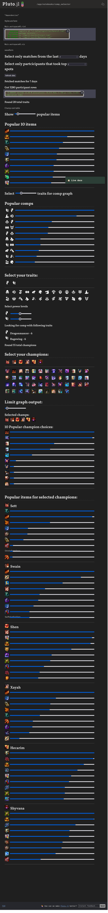

[](https://mybinder.org/v2/gh/Gonzih/tft-meta-analysis/v0.2.2?urlpath=pluto%2Fopen%3Fpath%3Dcomp_selector.jl)

# [Rendered version](https://spontaneous-stroopwafel-0c311e.netlify.app/meta.html)

# Running locally

## Docker

```
docker run -p 8888:8888 gonzih/tft.jl
```

After doing this you should be able to access UI via http://localhost:8888/open?path=comp_selector.jl

# TFT Match history analysis



# Powered by 

* [Pluto.jl](https://github.com/fonsp/Pluto.jl)
* [Julia lang](https://julialang.org/)
